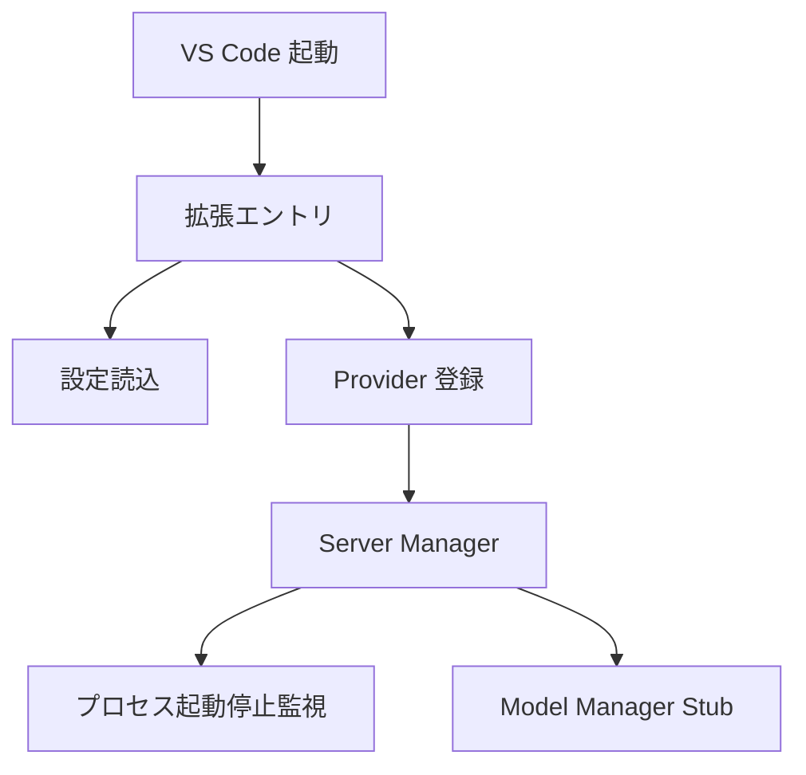

# VS Code 拡張 初期セットアップ設計

## 1. 目的

[README.md](../README.md) の記述に基づき、Apple の MLX モデルを Language Model API として提供する VS Code 拡張の最小構成を定義する。初期セットアップ段階では、実動する推論機能の完成ではなく、後続の TDD 実装が迷わず進められる骨格を確立することを目的とする。加えて、issue `globalpocket/mlx-provider#2` に対する設計差分として、ローカルで `vsce package` または `npx vsce package` を成功させ、`.vsix` を生成できる packaging 経路の修復方針を定義する。

## 2. 設計根拠

- [README.md](../README.md:2) より、本拡張は VS Code 拡張である。
- [README.md](../README.md:2) より、MLX モデルを Language Model API として提供する責務を持つ。
- [README.md](../README.md:2) より、ローカルサーバー管理とモデル管理を自動化する責務を持つ。
- 現行ワークスペースには [package.json](../package.json)、[src/](../src)、[tests/](../tests) が存在するため、本設計は [README.md](../README.md) に加えて現行実装と packaging 成功結果を一次情報として同期する。

## 3. スコープ

### 対象

- 拡張エントリポイントの定義
- ユーザー設定の最小定義
- Language Model Provider の登録骨格
- ローカル MLX サーバープロセス管理の骨格
- 将来のモデル管理を差し込める責務境界
- TDD に必要なテスト対象の分割

### 非対象

- MLX 実行バイナリの詳細選定
- モデルのダウンロード実装
- 実ネットワーク通信の完成実装
- CI と Marketplace 公開作業

## 4. 最小アーキテクチャ



## 5. 主要コンポーネントと責務

### 5.1 拡張エントリ

- 役割: 拡張の有効化、依存コンポーネントの生成、Provider の登録、終了時のライフサイクル管理。
- 現時点では設定値の解釈や Language Model API の詳細決定を担当せず、依存生成と disposable 管理に責務を絞る。
- 想定ファイル: `src/extension.ts`
- 公開インターフェース:
  - `activate(context: vscode.ExtensionContext): Promise<void>`
  - `deactivate(): Promise<void>`
- `activate()` の最小責務:
  - `getExtensionConfig()`、`getServerConfig()`、`vscode.workspace.getConfiguration()` などの設定取得結果を現時点では直接消費しない。設定契約の具体化は `config.ts` / `serverManager.ts` 側の将来タスクへ保留する。
  - `ServerManager` を 1 回だけ生成し、その同一インスタンスを `MlxLanguageModelProvider` へ constructor 注入する。
  - `register()` の返却した実在する `vscode.Disposable` を `context.subscriptions` へ 1 回追加し、dispose の実行時機は VS Code 標準ライフサイクルへ委譲する。
  - `activate()` 自身は `ServerManager.stop()` を呼ばない。
- `deactivate()` の最小責務:
  - `activate()` で保持した同一の `ServerManager` インスタンスが存在する場合に限り、`stop()` を 1 回 await して終了時の後始末を委譲する。
  - `activate()` が未実行、または `ServerManager` が未保持の状態では、新しい依存を生成せず何もせず完了できる。
  - `context.subscriptions` の dispose、Provider の再登録、設定再読込は担当しない。
- 次の Red テストで固定する extension 契約:
  - `activate()` は `ServerManager` を 1 回生成し、その同一参照を `MlxLanguageModelProvider` へ渡す。
  - `activate()` は設定値を直接参照せず、`register()` の返却した `vscode.Disposable` を `context.subscriptions` へ追加する。
  - `deactivate()` は保持済み `ServerManager` に対してのみ `stop()` を 1 回呼び、未初期化時は no-op で完了する。

### 5.2 設定定義

- 役割: VS Code 設定から必要値を読み取る。
- 初期段階では `mlxProvider` 配下の次のネスト設定のみを扱う。
  - `server.port`
  - `server.host`
  - `model.defaultModel`
- 想定ファイル: `src/config.ts`
- 公開インターフェース:
  - `getExtensionConfig(): ExtensionConfig`
  - `getServerConfig(): ServerConfig`
- 既定値:
  - `server.port`: `8080`
  - `server.host`: `127.0.0.1`
  - `model.defaultModel`: `mlx-community/Qwen3.5-9B-OptiQ-4bit`
- 設定取得方針:
  - `getExtensionConfig()` は `vscode.workspace.getConfiguration("mlxProvider")` から `server.port`、`server.host`、`model.defaultModel` を読み取り、拡張全体で使う設定モデルを返す。
  - `getServerConfig()` は同じ設定ソースから `server.port` と `server.host` だけを読み取り、サーバー起動責務へ渡す最小構成を返す。
- 想定データ構造:

```ts
type ExtensionConfig = {
  server: {
    port: number;
    host: string;
  };
  model: {
    defaultModel: string;
  };
};

type ServerConfig = {
  port: number;
  host: string;
};
```

### 5.3 Provider 骨格

- 役割: VS Code 側へ Language Model API の提供口を登録する。
- 初期段階では登録可能であること、Server Manager の最小契約だけに依存すること、未確定な Language Model 登録 API を明示的な境界の後ろへ隔離することを重視する。
- 想定ファイル: `src/provider.ts`
- 公開インターフェース:
  - `type ProviderServerRuntime`
  - `class MlxLanguageModelProvider`
  - `register(): vscode.Disposable`
- 依存注入方式の固定:
  - Provider は自前で `ServerManager` を生成しない。
  - `extension.ts` が生成した単一の `ServerManager` インスタンス、または同じ形を持つテストダブルを constructor 注入する。
  - 初期段階では次の最小契約だけを Provider 側の依存境界として扱う。

```ts
type ProviderServerRuntime = {
  start(): Promise<void>;
  stop(): Promise<void>;
  isRunning(): boolean;
};

class MlxLanguageModelProvider {
  constructor(
    serverManager: ProviderServerRuntime,
    registrationBoundary: ProviderRegistrationBoundary,
  );
  register(): vscode.Disposable;
}
```

- 登録境界の扱い:
  - `src/provider.ts` は `import * as vscode from "vscode"` を持ち、`register()` の返却値を型上も実体上も `vscode.Disposable` として扱う。
  - reviewer 指摘を受け、provider が依存する registration boundary は「実在確認済みの VS Code API 名をここで推測固定しない」前提へ改める。固定するのは API 名ではなく、`src/provider.ts` に見える型契約だけとする。

    ```ts
    type ProviderServerRuntime = Pick<ServerManager, "start" | "stop" | "isRunning">;
    type ProviderRegistrationBoundary = (
      provider: MlxLanguageModelProvider,
    ) => vscode.Disposable;
    ```

  - `ProviderRegistrationBoundary` は「provider インスタンスを extension 側の登録アダプタへ受け渡し、そのアダプタが返す `vscode.Disposable` をそのまま返す関数」と定義する。
  - 実際の VS Code Language Model 登録 API 名称、追加引数、または別アダプタの採否は `src/extension.ts` 側に閉じ込める。`src/provider.ts` と `plans/design.md` は、実在未確認 API 名を契約本文へ書き込まない。
  - 現行の正契約は [`activate()`](../src/extension.ts:7) が provider の [`register()`](../src/provider.ts:25) を 1 回だけ呼び、その戻り値 `vscode.Disposable` を同一参照のまま `context.subscriptions.push(...)` へ渡すこと。一次情報は [`src/provider.ts`](../src/provider.ts:25) の戻り値契約と、coverage 94.11% で成立した extension/provider テスト群とする。
- 生成方法:
  - `src/extension.ts` が `ServerManager` を 1 度だけ生成し、その参照を `ProviderServerRuntime` として保持する。
  - `src/extension.ts` が `ProviderRegistrationBoundary` を 1 つ組み立て、`new MlxLanguageModelProvider(serverRuntime, registrationBoundary)` へ渡す。
  - `src/extension.ts` は登録境界の所有者ではあるが、登録実行の入口としては `provider.register()` だけを呼ぶ。`activate()` 本体に登録アダプタの具体 API 名を固定せず、provider を迂回する別経路も持ち込まない。
  - Provider は受け取った runtime と boundary を保持するだけで、登録時に `ServerManager` や boundary 実装を差し替えない。
- `register()` の最小責務:
  - `this.registrationBoundary(this)` を 1 回だけ呼び出す。
  - registration boundary が返した実在の `vscode.Disposable` をそのまま返す。
  - `vscode.Disposable.from(...)`、アドホックな `{ dispose() {} }`、または provider 自身を disposable と見なす代替経路は使わない。
  - `ServerManager.start()` や `ServerManager.stop()` を登録フェーズでは呼ばない。
  - `context.subscriptions` への push、設定読込、`ServerManager` 生成は担当しない。
- `vscode.Disposable` の扱い:
  - 返却値の所有者は caller 側、すなわち `src/extension.ts` である。
  - `src/extension.ts` は `register()` の返却値を `context.subscriptions` へ追加し、dispose のタイミングを VS Code 標準ライフサイクルへ委譲する。
  - Provider 自身は、boundary から返された `vscode.Disposable` を内部で再 dispose しない。
- 現在の実装境界:
  - `src/provider.ts` は現行契約の基準実装であり、[`register()`](../src/provider.ts:25) が registration boundary への委譲だけを担当する。
  - `src/extension.ts` は provider 生成後の登録フローを担当し、[`activate()`](../src/extension.ts:7) から `provider.register()` を呼び、その返却 disposable を購読ライフサイクルへ渡す。
  - boundary 実装の具体 API は extension ローカルへ閉じ込めるが、設計上の必須挙動は「provider を経由して disposable を得る」ことだけである。
- 確定済み provider 契約:
  - constructor は `ProviderServerRuntime` と `ProviderRegistrationBoundary` を受け取り、runtime 依存と登録依存を分離して保持できる。
  - `register()` は `this.registrationBoundary(this)` を 1 回だけ呼び、その戻り値である実在の `vscode.Disposable` を同一参照のまま返す。
  - `register()` 実行中は設定取得を行わず、runtime の `start()` と `stop()` を呼ばない。
- extension 側で維持する禁止パターン:
  - 実在未確認の VS Code API 名を設計契約へ固定しない。
  - provider 登録経路を迂回する direct registration を `activate()` に持ち込まない。
  - テスト変更や assertion 緩和で登録経路の不整合を隠蔽しない。

### 5.4 Server Manager 骨格

- 役割: ローカルサーバープロセスの起動、停止、状態管理。
- 初期段階では実プロセス詳細を固定せず、プロセス管理の責務境界だけ先に定義する。
- 想定ファイル: `src/serverManager.ts`
- 公開インターフェース:
  - `class ServerManager`
  - `start(): Promise<void>`
  - `stop(): Promise<void>`
  - `isRunning(): boolean`

### 5.5 Model Manager Stub

- 役割: 将来のモデル確認、取得、切替処理の受け口。
- 初期段階では Server Manager または Provider へ直接ロジックを混ぜないための占位責務として置く。
- 想定ファイル: `src/modelManager.ts`
- 公開インターフェース:
  - `class ModelManager`
  - `ensureModelAvailable(modelId: string): Promise<void>`

## 6. 想定ファイル構成

```text
package.json
src/
  extension.ts
  config.ts
  provider.ts
  serverManager.ts
  modelManager.ts
tests/
  extension.test.ts
  config.test.ts
  provider.test.ts
  serverManager.test.ts
```

## 7. 依存方向

- [extension.ts](../src/extension.ts) は [config.ts](../src/config.ts), [provider.ts](../src/provider.ts), [serverManager.ts](../src/serverManager.ts) に依存する。
- [provider.ts](../src/provider.ts) は [serverManager.ts](../src/serverManager.ts) の具象実装そのものではなく、`start`, `stop`, `isRunning` を持つ最小契約へ依存し、その実体は [extension.ts](../src/extension.ts) から注入される。
- [serverManager.ts](../src/serverManager.ts) は将来 [modelManager.ts](../src/modelManager.ts) を利用できるが、初期段階では結合を最小化する。
- [config.ts](../src/config.ts) は他コンポーネントから参照されるが、副作用を持たない。

## 8. 初期公開インターフェース方針

後続実装では、外部から直接使う API を最小に保ち、テストしやすい純粋関数または小さなクラスへ寄せる。

| コンポーネント | 公開要素 | 理由 |
| --- | --- | --- |
| Entry | `activate`, `deactivate` | VS Code 拡張標準ライフサイクル |
| Config | `getExtensionConfig` | 設定読込責務を 1 箇所へ集約 |
| Provider | `MlxLanguageModelProvider`, `register` | 登録責務と依存注入境界を固定し、Red テストを小さく保つ |
| Server Manager | `start`, `stop`, `isRunning` | ライフサイクル境界を固定 |
| Model Manager | `ensureModelAvailable` | 将来拡張用の受け口 |

## 9. 実装上の前提

- VS Code API への依存点は [extension.ts](../src/extension.ts) と [provider.ts](../src/provider.ts) に寄せる。
- 設定解決や状態遷移は単体テストしやすいように分離する。
- サーバープロセス実体は初回実装ではダミーまたは抽象化で表現し、TDD の Green を阻害しないようにする。
- README に記載のない高度機能は設計へ含めない。

## 10. TDD 方針

### Red

- まず [tests/config.test.ts](../tests/config.test.ts) で設定解決ルールを固定する。
- 次に [tests/serverManager.test.ts](../tests/serverManager.test.ts) で起動状態遷移の期待を固定する。
- 次に [tests/provider.test.ts](../tests/provider.test.ts) で constructor 注入、`register()` の返却値、登録中に `start()` / `stop()` を呼ばないことを固定する。
- 最後に [tests/extension.test.ts](../tests/extension.test.ts) で次の 3 点だけを固定する: `activate()` が `ServerManager` を 1 回生成して Provider へ注入すること、`register()` の返却値を `context.subscriptions` へ追加すること、`deactivate()` が保持済み `ServerManager.stop()` を 1 回だけ呼び未初期化時は no-op であること。

### Green

- 1 テスト群ごとに必要最小限の実装のみ追加する。
- 実プロセス起動やネットワーク呼び出しはテストダブルで隔離する。

### Refactor

- コンポーネント境界を崩さず、依存注入しやすい形へ整える。
- VS Code API 依存箇所の局所化を維持する。

### Evaluation

- 単体テストを各サブタスク後に再実行する。
- 対象モジュールのカバレッジ 85%以上を完了条件に含める。

## 11. 後続実装サブタスクの起点

最初の実装系サブタスクは、設定定義の Red を作ることが最も安全である。理由は、VS Code API や実プロセス管理よりも依存が少なく、後続コンポーネントの入力境界を先に固定できるためである。

## 12. `vsce package` 最終契約

### 12.1 現在の観測事実

- [package.json](../package.json) の `main` は `./dist/extension.js` を指している。
- [package.json](../package.json) の `scripts` には `build` と `vscode:prepublish` が定義されている。
- packaging 経路は復旧済みであり、`npx vsce package` により `.vsix` を生成できる状態まで確認済みである。
- packaging 対応後の最終監査として security Pass と review Pass が得られている。

### 12.2 現行の packaging 契約

1. **manifest 契約**
   - [package.json](../package.json) が `main`, `build`, `vscode:prepublish` の整合を単独で所有する。
   - `main` が要求する成果物は `./dist/extension.js` とする。
2. **成果物契約**
   - `npm run build` または `vscode:prepublish` により、packaging 前に `dist/extension.js` へ到達できることを保証する。
   - build 出力先を [package.json](../package.json) の `main` と別経路へ分岐させない。
3. **実行契約**
   - `npx vsce package` 実行時には prepublish 導線経由で packaging 前提成果物が解決される。
   - 成功判定は終了コード 0 と `.vsix` 生成の両立とする。

### 12.3 回帰防止条件

- packaging のためだけに実行経路を二重化しない。
- `main`、`build`、`vscode:prepublish` の責務を 1 箇所ずつに保ち、重複コマンドを追加しない。
- 既存ユニットテスト群を維持し、関連 coverage 85%以上の基準を下回らない。
- packaging 修正後も reviewer が指摘した registration boundary 契約と衝突させない。

### 12.4 将来の変更制約

- packaging 契約の第一編集点は引き続き [package.json](../package.json) とする。
- [tsconfig.json](../tsconfig.json) は `dist/extension.js` と出力先不整合が再発した場合のみ編集対象へ昇格する。
- 実在未確認ツールや追加の build 経路を設計へ持ち込まず、現行の prepublish 導線を維持する。

## 13. Issue #8: OutputChannel 初期化境界の固定

### 13.1 目的

- issue `globalpocket/mlx-provider#8` の要求に従い、[`activate()`](../src/extension.ts:7) で trace 用 `OutputChannel` を専用名で初期化し、同一拡張ライフサイクル内で再利用する契約を Red→Green で固定する。
- OutputChannel 生成責務を明示的な境界へ分離し、[`src/extension.ts`](../src/extension.ts) の可観測な挙動をテストで固定する。

### 13.2 スコープ

#### 対象

- [`src/extension.ts`](../src/extension.ts) 内の OutputChannel 生成経路の責務分割。
- trace チャネル名の固定。
- 生成 1 回・再利用の契約化。
- [`tests/extension.test.ts`](../tests/extension.test.ts) による Red 先行テスト観点の明確化。

#### 非対象

- provider 実装や server 起動契約の再設計。
- OutputChannel へのログ出力内容の仕様化。
- [package.json](../package.json) や CI 設定の変更。

### 13.3 責務分割

- **拡張エントリ責務**（[`activate()`](../src/extension.ts:7)）
  - trace チャネルの取得を専用境界へ委譲する。
  - `OutputChannel` の生成詳細を `activate()` 本体に直書きしない。
  - Provider 登録と `context.subscriptions` への登録を継続する。

- **初期化境界責務**（`src/extension.ts` のモジュール内ヘルパー）
  - `vscode.window.createOutputChannel` を呼ぶ唯一の入口を提供する。
  - 既存インスタンスがある場合は同一参照を返し、重複生成しない。
  - チャネル名を定数として固定し、テストで検証可能にする。

### 13.4 公開インターフェース方針

- 外部公開 API は増やさず、[`activate()`](../src/extension.ts:7) / [`deactivate()`](../src/extension.ts:18) の契約を維持する。
- `OutputChannel` 境界は module-private 関数として保持し、次の内部インターフェースを設計契約とする。

```ts
const TRACE_OUTPUT_CHANNEL_NAME = "MLX Provider Trace";

function getOrCreateTraceOutputChannel(
  vscodeApi: Pick<typeof vscode, "window"> = vscode,
): vscode.OutputChannel;
```

- `getOrCreateTraceOutputChannel()` 契約:
  - 初回呼び出し時のみ `vscodeApi.window.createOutputChannel(TRACE_OUTPUT_CHANNEL_NAME)` を 1 回実行する。
  - 2 回目以降はキャッシュ済み `OutputChannel` を返し、追加生成しない。

### 13.5 テスト観点（TDD）

#### Red

- [`tests/extension.test.ts`](../tests/extension.test.ts) で次を先に失敗させる。
  1. [`activate()`](../src/extension.ts:7) 実行時に `createOutputChannel` が未呼び出しなら失敗。
  2. 呼び出し名が `MLX Provider Trace` と不一致なら失敗。
  3. 同一ライフサイクル想定で重複生成が発生する実装なら失敗。

#### Green

- [`src/extension.ts`](../src/extension.ts) に最小実装を追加し、上記 Red を解消する。
- 既存の provider 登録契約と `ServerManager` 後始末契約を壊さない。

#### Refactor

- `activate()` の可読性を維持しつつ、OutputChannel 初期化処理を helper 関数へ局所化する。
- API 境界（公開 / 非公開）を維持し、外部公開面を増やさない。

#### Evaluation

- ユニットテスト成功を確認する。
- 対象テスト群で coverage 85%以上を維持する。

### 13.6 受け入れ条件へのトレーサビリティ

- **OutputChannel初期化境界の固定化**: `createOutputChannel` 呼び出しを専用境界へ限定し、重複生成なしをテストで固定。
- **テスト先行**: Red 失敗（未呼び出し / 回数不一致 / 名前不一致）を先に確認。
- **Coverage 85%以上維持**: テスト実行フェーズで継続評価し、品質ゲートとして必須化。

## 14. Issue #9: 起動イベントトレース出力の固定

### 14.1 目的

- issue `globalpocket/mlx-provider#9` の要求に従い、[`activate()`](../src/extension.ts:7) の開始と完了を出力パネルへ定型ログとして記録する契約を固定する。
- 1 TDD サイクルで 1 つの観測可能振る舞いだけを扱い、Issue #9 では「起動開始ログ」と「起動成功ログ」の 2 イベント順序を単一の振る舞いとして定義する。

### 14.2 スコープ

#### 対象

- [`src/extension.ts`](../src/extension.ts) における起動イベントの trace 出力順序。
- [`tests/extension.test.ts`](../tests/extension.test.ts) における Red 先行の期待固定。
- 既存の provider 登録契約と `deactivate()` 停止契約を壊さない境界追加。

#### 非対象

- `mlx_lm.server` の stdout/stderr 転送仕様。
- 失敗時エラートレース仕様（Issue #10 以降の別振る舞い）。
- [package.json](../package.json) や CI 設定の変更。

### 14.3 責務分割

- **拡張エントリ責務**（[`activate()`](../src/extension.ts:7)）
  - 起動開始時に trace ログを 1 回出力する。
  - provider 登録成功後に起動完了ログを 1 回出力する。
  - 既存の `ServerManager` 生成、provider 登録、subscription 登録契約を維持する。

- **trace 出力境界責務**（`src/extension.ts` の module-private 関数）
  - 起動イベントの文言フォーマットを 1 箇所へ集約する。
  - `OutputChannel` 取得境界（Issue #8 で固定）を再利用し、`activate()` 本体へ文字列直書きを分散させない。

### 14.4 公開インターフェース方針

- 外部公開 API は増やさず、[`activate()`](../src/extension.ts:7) / [`deactivate()`](../src/extension.ts:18) 契約を維持する。
- module-private の起動 trace 境界を追加し、次の内部インターフェースを設計契約とする。

```ts
const TRACE_START_MESSAGE = "[activate] start";
const TRACE_READY_MESSAGE = "[activate] ready";

function appendActivationTrace(
  channel: Pick<vscode.OutputChannel, "appendLine">,
  message: string,
): void;
```

- `appendActivationTrace(...)` 契約:
  - `activate()` の開始時と成功時にのみ呼び出す。
  - 1 回の `activate()` で start → ready の順序を維持する。
  - `deactivate()` 側からは呼び出さない。

### 14.5 テスト観点（TDD）

#### Red

- [`tests/extension.test.ts`](../tests/extension.test.ts) で次を先に失敗させる。
  1. [`activate()`](../src/extension.ts:7) 実行時に start ログ未出力なら失敗。
  2. provider 登録成功後に ready ログ未出力なら失敗。
  3. 出力順序が start → ready でない場合は失敗。

#### Green

- [`src/extension.ts`](../src/extension.ts) に最小実装を追加し、上記 Red を解消する。
- 既存契約（`register()` の返却 disposable を `context.subscriptions` へ追加、`deactivate()` の停止契約）を維持する。

#### Refactor

- 起動 trace 文言と出力呼び出しを helper へ局所化し、`activate()` の責務を増やしすぎない。
- 既存の OutputChannel 境界を再利用し、重複ロジックを追加しない。

#### Evaluation

- 関連ユニットテスト成功を確認する。
- [`tests/extension.test.ts`](../tests/extension.test.ts) を含む対象テスト群で coverage 85%以上を維持する。
- 後続品質ゲートとして `security-auditor` Pass と `reviewer` Pass を必須とする。

### 14.6 受け入れ条件へのトレーサビリティ

- **開始/完了の 2 イベント出力**: start と ready がそれぞれ 1 回ずつ出力されることを固定。
- **順序保証**: start → ready の時系列順をテストで固定し、回帰を防止。
- **ライフサイクル非破壊**: provider 登録と `deactivate()` 契約を維持し、既存責務を壊さない。
- **品質ゲート**: TDD Red-Green-Refactor、coverage 85%以上、`security-auditor` Pass、`reviewer` Pass を必須化。

### 14.7 B段階ゲート再定義（Contract Mismatch 是正）

- 背景: B段階の `test-red` 実行結果は [`artifacts/test-results/issue-9-red-b.log`](../artifacts/test-results/issue-9-red-b.log) のとおり全件passであり、未実装を示す失敗を観測できなかった。この状態で Red 必須ゲートを維持すると、実装済み振る舞いに対して Red を要求し続ける契約不整合となる。
- 是正方針: A段階で成立済みの Red→Green を保持し、B段階は `test-red` 必須を解除して `test-green` 回帰確認 + coverage 判定へ再定義する。

1. **A段階の位置づけ固定（変更なし）**
   - 目的: `appendLine` 呼び出し存在の未成立を Red として観測し、Green で解消する。
   - 判定規約: A段階の Red/Green 証跡を有効な基準として保持し、B段階の再判定理由に利用する。

2. **B段階ゲートの置換（Red必須解除）**
   - 前提: A段階 Green 済み、かつ B段階 `test-red` が全件pass。
   - 新ゲート: `tester` が回帰実行した `test-green` 結果と coverage 結果を `consistency-checker` が判定する。
   - 判定規約: B段階では `unexpected-red`（全件pass）を失敗扱いしない。完了条件は `test-green: pass` + `coverage: pass` + Forbidden Files 非変更とする。

3. **次モードの固定順序（SoD）**
   - 実行順は `tester` → `consistency-checker` → `security-auditor` → `reviewer` に固定する。
   - `tester` は [`artifacts/test-results/issue-9-green-b.log`](../artifacts/test-results/issue-9-green-b.log) と [`artifacts/coverage/issue-9-green-b.log`](../artifacts/coverage/issue-9-green-b.log) へ保存する。
   - `consistency-checker` は `test-green` / `coverage` のみ判定し、Red 成立判定へ戻さない。

- 影響範囲最小化: 再設計は B段階の判定契約と実行順のみを変更し、[`src/extension.ts`](../src/extension.ts) の公開 API、provider 登録契約、[`deactivate()`](../src/extension.ts:18) 停止契約は変更しない。
