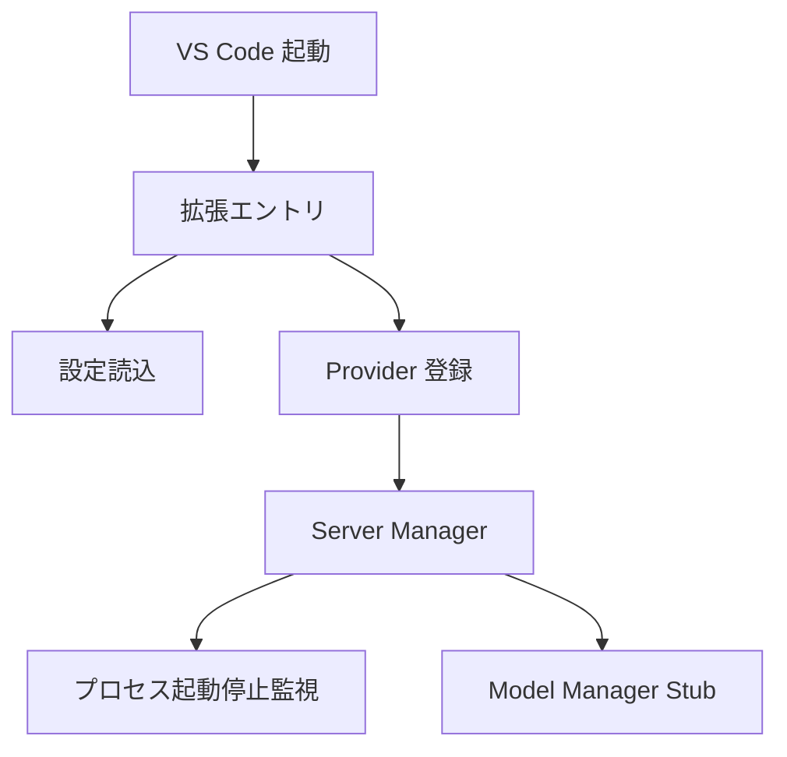

# VS Code 拡張 初期セットアップ設計

## 1. 目的

[README.md](../README.md) の記述に基づき、Apple の MLX モデルを Language Model API として提供する VS Code 拡張の最小構成を定義する。初期セットアップ段階では、実動する推論機能の完成ではなく、後続の TDD 実装が迷わず進められる骨格を確立することを目的とする。

## 2. 設計根拠

- [README.md](../README.md:2) より、本拡張は VS Code 拡張である。
- [README.md](../README.md:2) より、MLX モデルを Language Model API として提供する責務を持つ。
- [README.md](../README.md:2) より、ローカルサーバー管理とモデル管理を自動化する責務を持つ。
- 現時点では [package.json](../package.json) や [src](../src) が未作成であるため、初期設計は README の情報だけを根拠にした最小構成に限定する。

## 3. スコープ

### 対象

- 拡張エントリポイントの定義
- ユーザー設定の最小定義
- Language Model Provider の登録骨格
- ローカル MLX サーバープロセス管理の骨格
- 将来のモデル管理を差し込める責務境界
- TDD に必要なテスト対象の分割

### 非対象

- MLX 実行バイナリの詳細選定
- モデルのダウンロード実装
- 実ネットワーク通信の完成実装
- 配布設定、CI、公開作業

## 4. 最小アーキテクチャ



## 5. 主要コンポーネントと責務

### 5.1 拡張エントリ

- 役割: 拡張の有効化、依存コンポーネントの生成、Provider の登録、終了時のライフサイクル管理。
- 現時点では設定値の解釈や Language Model API の詳細決定を担当せず、依存生成と disposable 管理に責務を絞る。
- 想定ファイル: `src/extension.ts`
- 公開インターフェース:
  - `activate(context: vscode.ExtensionContext): Promise<void>`
  - `deactivate(): Promise<void>`
- `activate()` の最小責務:
  - `getExtensionConfig()`、`getServerConfig()`、`vscode.workspace.getConfiguration()` などの設定取得結果を現時点では直接消費しない。設定契約の具体化は `config.ts` / `serverManager.ts` 側の将来タスクへ保留する。
  - `ServerManager` を 1 回だけ生成し、その同一インスタンスを `MlxLanguageModelProvider` へ constructor 注入する。
  - `register()` の返却した実在する `vscode.Disposable` を `context.subscriptions` へ 1 回追加し、dispose の実行時機は VS Code 標準ライフサイクルへ委譲する。
  - `activate()` 自身は `ServerManager.stop()` を呼ばない。
- `deactivate()` の最小責務:
  - `activate()` で保持した同一の `ServerManager` インスタンスが存在する場合に限り、`stop()` を 1 回 await して終了時の後始末を委譲する。
  - `activate()` が未実行、または `ServerManager` が未保持の状態では、新しい依存を生成せず何もせず完了できる。
  - `context.subscriptions` の dispose、Provider の再登録、設定再読込は担当しない。
- 次の Red テストで固定する extension 契約:
  - `activate()` は `ServerManager` を 1 回生成し、その同一参照を `MlxLanguageModelProvider` へ渡す。
  - `activate()` は設定値を直接参照せず、`register()` の返却した `vscode.Disposable` を `context.subscriptions` へ追加する。
  - `deactivate()` は保持済み `ServerManager` に対してのみ `stop()` を 1 回呼び、未初期化時は no-op で完了する。

### 5.2 設定定義

- 役割: VS Code 設定から必要値を読み取る。
- 初期段階では `mlxProvider` 配下の次のネスト設定のみを扱う。
  - `server.port`
  - `server.host`
  - `model.defaultModel`
- 想定ファイル: `src/config.ts`
- 公開インターフェース:
  - `getExtensionConfig(): ExtensionConfig`
  - `getServerConfig(): ServerConfig`
- 既定値:
  - `server.port`: `8080`
  - `server.host`: `127.0.0.1`
  - `model.defaultModel`: `mlx-community/Qwen3.5-9B-4bit`
- 設定取得方針:
  - `getExtensionConfig()` は `vscode.workspace.getConfiguration("mlxProvider")` から `server.port`、`server.host`、`model.defaultModel` を読み取り、拡張全体で使う設定モデルを返す。
  - `getServerConfig()` は同じ設定ソースから `server.port` と `server.host` だけを読み取り、サーバー起動責務へ渡す最小構成を返す。
- 想定データ構造:

```ts
type ExtensionConfig = {
  server: {
    port: number;
    host: string;
  };
  model: {
    defaultModel: string;
  };
};

type ServerConfig = {
  port: number;
  host: string;
};
```

### 5.3 Provider 骨格

- 役割: VS Code 側へ Language Model API の提供口を登録する。
- 初期段階では登録可能であること、Server Manager の最小契約だけに依存すること、未確定な Language Model 登録 API を明示的な境界の後ろへ隔離することを重視する。
- 想定ファイル: `src/provider.ts`
- 公開インターフェース:
  - `type ProviderServerRuntime`
  - `class MlxLanguageModelProvider`
  - `register(): vscode.Disposable`
- 依存注入方式の固定:
  - Provider は自前で `ServerManager` を生成しない。
  - `extension.ts` が生成した単一の `ServerManager` インスタンス、または同じ形を持つテストダブルを constructor 注入する。
  - 初期段階では次の最小契約だけを Provider 側の依存境界として扱う。

```ts
type ProviderServerRuntime = {
  start(): Promise<void>;
  stop(): Promise<void>;
  isRunning(): boolean;
};

class MlxLanguageModelProvider {
  constructor(serverManager: ProviderServerRuntime);
  register(): vscode.Disposable;
}
```

- 登録境界の扱い:
  - `src/provider.ts` は `import * as vscode from "vscode"` を持ち、`register()` の返却値を型上も実体上も `vscode.Disposable` として扱う。
  - reviewer 指摘を受け、provider が依存する registration boundary の内部 API は次の 1 つに固定する。

    ```ts
    type ProviderServerRuntime = Pick<ServerManager, "start" | "stop" | "isRunning">;
    type ProviderRegistrationBoundary = (
      provider: MlxLanguageModelProvider,
    ) => vscode.Disposable;
    ```

  - `ProviderRegistrationBoundary` は「現在の provider インスタンスを VS Code 側の実登録 API へ橋渡しし、その API が返した実在の `vscode.Disposable` を返す関数」と定義する。
  - 実際の VS Code Language Model 登録 API 名称や追加引数は `src/extension.ts` 側の boundary 実装へ閉じ込め、`src/provider.ts` からは見えない契約にする。
- 生成方法:
  - `src/extension.ts` が `ServerManager` を 1 度だけ生成し、その参照を `ProviderServerRuntime` として保持する。
  - `src/extension.ts` が `ProviderRegistrationBoundary` を 1 つ組み立て、`new MlxLanguageModelProvider(serverRuntime, registrationBoundary)` へ渡す。
  - Provider は受け取った runtime と boundary を保持するだけで、登録時に `ServerManager` や boundary 実装を差し替えない。
- `register()` の最小責務:
  - `this.registrationBoundary(this)` を 1 回だけ呼び出す。
  - registration boundary が返した実在の `vscode.Disposable` をそのまま返す。
  - `vscode.Disposable.from(...)`、アドホックな `{ dispose() {} }`、または provider 自身を disposable と見なす代替経路は使わない。
  - `ServerManager.start()` や `ServerManager.stop()` を登録フェーズでは呼ばない。
  - `context.subscriptions` への push、設定読込、`ServerManager` 生成は担当しない。
- `vscode.Disposable` の扱い:
  - 返却値の所有者は caller 側、すなわち `src/extension.ts` である。
  - `src/extension.ts` は `register()` の返却値を `context.subscriptions` へ追加し、dispose のタイミングを VS Code 標準ライフサイクルへ委譲する。
  - Provider 自身は、boundary から返された `vscode.Disposable` を内部で再 dispose しない。
- 次工程の実装境界:
  - `src/provider.ts` の修正範囲は import 群、constructor、`register()` に限定し、boundary 呼び出し以外の責務を増やさない。
  - `src/extension.ts` は provider 生成箇所でのみ boundary 実装を与え、`context.subscriptions.push(provider.register())` の所有関係を維持する。
- reviewer 指摘を解消するため、次の Red で固定する provider 契約:
  - constructor は `ProviderServerRuntime` と `ProviderRegistrationBoundary` を受け取り、runtime 依存と登録依存を分離して保持できる。
  - `register()` は `this.registrationBoundary(this)` を 1 回だけ呼び、その戻り値である実在の `vscode.Disposable` を同一参照のまま返す。
  - `register()` 実行中は設定取得を行わず、runtime の `start()` と `stop()` を呼ばない。

### 5.4 Server Manager 骨格

- 役割: ローカルサーバープロセスの起動、停止、状態管理。
- 初期段階では実プロセス詳細を固定せず、プロセス管理の責務境界だけ先に定義する。
- 想定ファイル: `src/serverManager.ts`
- 公開インターフェース:
  - `class ServerManager`
  - `start(): Promise<void>`
  - `stop(): Promise<void>`
  - `isRunning(): boolean`

### 5.5 Model Manager Stub

- 役割: 将来のモデル確認、取得、切替処理の受け口。
- 初期段階では Server Manager または Provider へ直接ロジックを混ぜないための占位責務として置く。
- 想定ファイル: `src/modelManager.ts`
- 公開インターフェース:
  - `class ModelManager`
  - `ensureModelAvailable(modelId: string): Promise<void>`

## 6. 想定ファイル構成

```text
package.json
src/
  extension.ts
  config.ts
  provider.ts
  serverManager.ts
  modelManager.ts
tests/
  extension.test.ts
  config.test.ts
  provider.test.ts
  serverManager.test.ts
```

## 7. 依存方向

- [extension.ts](../src/extension.ts) は [config.ts](../src/config.ts), [provider.ts](../src/provider.ts), [serverManager.ts](../src/serverManager.ts) に依存する。
- [provider.ts](../src/provider.ts) は [serverManager.ts](../src/serverManager.ts) の具象実装そのものではなく、`start`, `stop`, `isRunning` を持つ最小契約へ依存し、その実体は [extension.ts](../src/extension.ts) から注入される。
- [serverManager.ts](../src/serverManager.ts) は将来 [modelManager.ts](../src/modelManager.ts) を利用できるが、初期段階では結合を最小化する。
- [config.ts](../src/config.ts) は他コンポーネントから参照されるが、副作用を持たない。

## 8. 初期公開インターフェース方針

後続実装では、外部から直接使う API を最小に保ち、テストしやすい純粋関数または小さなクラスへ寄せる。

| コンポーネント | 公開要素 | 理由 |
| --- | --- | --- |
| Entry | `activate`, `deactivate` | VS Code 拡張標準ライフサイクル |
| Config | `getExtensionConfig` | 設定読込責務を 1 箇所へ集約 |
| Provider | `MlxLanguageModelProvider`, `register` | 登録責務と依存注入境界を固定し、Red テストを小さく保つ |
| Server Manager | `start`, `stop`, `isRunning` | ライフサイクル境界を固定 |
| Model Manager | `ensureModelAvailable` | 将来拡張用の受け口 |

## 9. 実装上の前提

- VS Code API への依存点は [extension.ts](../src/extension.ts) と [provider.ts](../src/provider.ts) に寄せる。
- 設定解決や状態遷移は単体テストしやすいように分離する。
- サーバープロセス実体は初回実装ではダミーまたは抽象化で表現し、TDD の Green を阻害しないようにする。
- README に記載のない高度機能は設計へ含めない。

## 10. TDD 方針

### Red

- まず [tests/config.test.ts](../tests/config.test.ts) で設定解決ルールを固定する。
- 次に [tests/serverManager.test.ts](../tests/serverManager.test.ts) で起動状態遷移の期待を固定する。
- 次に [tests/provider.test.ts](../tests/provider.test.ts) で constructor 注入、`register()` の返却値、登録中に `start()` / `stop()` を呼ばないことを固定する。
- 最後に [tests/extension.test.ts](../tests/extension.test.ts) で次の 3 点だけを固定する: `activate()` が `ServerManager` を 1 回生成して Provider へ注入すること、`register()` の返却値を `context.subscriptions` へ追加すること、`deactivate()` が保持済み `ServerManager.stop()` を 1 回だけ呼び未初期化時は no-op であること。

### Green

- 1 テスト群ごとに必要最小限の実装のみ追加する。
- 実プロセス起動やネットワーク呼び出しはテストダブルで隔離する。

### Refactor

- コンポーネント境界を崩さず、依存注入しやすい形へ整える。
- VS Code API 依存箇所の局所化を維持する。

### Evaluation

- 単体テストを各サブタスク後に再実行する。
- 対象モジュールのカバレッジ 85%以上を完了条件に含める。

## 11. 後続実装サブタスクの起点

最初の実装系サブタスクは、設定定義の Red を作ることが最も安全である。理由は、VS Code API や実プロセス管理よりも依存が少なく、後続コンポーネントの入力境界を先に固定できるためである。
